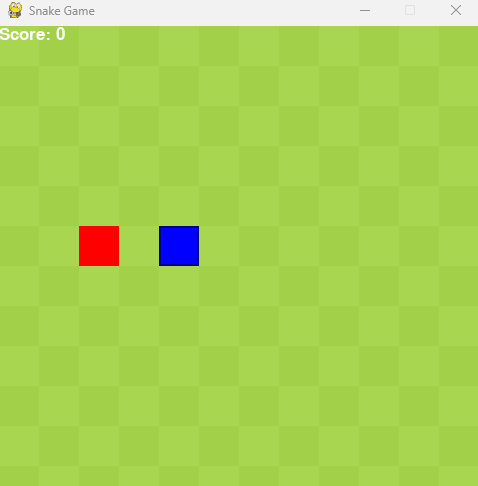

# AI 貪食蛇遊戲

## 專案簡介

這個專案是利用 PyTorch 製作的 AI 貪食蛇遊戲，並結合深度強化學習來訓練 AI 自動玩貪食蛇。目標是讓 AI 學會在遊戲中做出更好的決策，不斷提高分數。我們使用 Python 的 Pygame 庫來呈現遊戲畫面，並用深度 Q 網絡（DQN）來訓練 AI，讓它能夠學會如何避開障礙、吃掉食物。

## 目錄

- [專案簡介](#專案簡介)
- [安裝指南](#安裝指南)
- [使用說明](#使用說明)
- [遊戲演示](#遊戲演示)
- [系統需求](#系統需求)
- [功能特色](#功能特色)
- [模型架構](#模型架構)
- [強化學習算法](#強化學習算法)

## 安裝指南

### 1. 下載專案

首先，打開終端機，輸入以下指令來下載專案：

```bash
git clone https://github.com/Wei070901/snake_ai.git
cd snake_ai
```

### 2. 建立虛擬環境並安裝依賴

創建一個虛擬環境來管理專案的依賴：

```bash
python3 -m venv venv
source venv/bin/activate  # Windows 用戶執行 `venv\Scripts\activate`
pip install -r requirements.txt
```

### 3. 安裝 PyTorch

請前往 [PyTorch 官方網站](https://pytorch.org/)，根據您的系統選擇適合的安裝指令。

## 使用說明

### 1. 訓練 AI 模型

運行以下指令開始訓練 AI 模型：

```bash
python train.py
```

可以調整一些訓練參數，例如：

- `num_episodes`：訓練的回合數，預設為 1000。
- `batch_size`：每次訓練使用的樣本數，預設為 64。
- `gamma`：折扣因子，用來計算未來獎勵的現在價值，預設為 0.94。

### 2. 測試 AI 模型

訓練完成後，您可以使用以下指令來測試 AI 模型：

```bash
python train.py --test
```

AI 會根據訓練好的策略來玩遊戲，並顯示最終得分。

### 3. 顯示遊戲畫面

在訓練過程中，您可以看到遊戲畫面，觀察 AI 的決策。設置 `render_mode=True` 可以開啟或關閉畫面顯示。

## 遊戲演示



上圖顯示了 AI 貪食蛇遊戲的實際操作畫面，紅色方塊為食物，藍色方塊為蛇頭。

## 系統需求

- Python 3.8 或更高版本
- PyTorch 1.9.0 或更高版本
- Pygame
- Numpy
- TensorBoard（可選，用於監控訓練過程）

## 功能特色

- **智能貪食蛇 AI**：使用深度 Q 網絡（DQN）來訓練 AI，讓它自主學習如何在遊戲中取得高分。
- **動態遊戲畫面**：使用 Pygame 來顯示遊戲畫面，方便實時觀察 AI 的行為。
- **經驗回放**：儲存遊戲中的經驗，讓 AI 能從過去的經驗中學習，提高訓練效果。
- **訓練監控**：使用 TensorBoard 監控訓練過程中的損失和獎勵變化。
- **雙重 DQN**：避免 Q 值的過度估計，提升模型的穩定性和性能。

## 模型架構

我們使用深度 Q 網絡（DQN）來進行強化學習，模型結構如下：

- **輸入層**：接收遊戲的狀態資訊，輸入大小為 12，代表蛇的位置、食物的位置等特徵。
- **隱藏層**：包含兩個全連接層，每層有 256 個神經元，並使用 ReLU 激活函數來增加非線性。
  - **ReLU 激活函數**：可以讓模型學習到更複雜的特徵。
  - **Dropout 機制**：在隱藏層中加入 Dropout，防止過擬合，提升模型的泛化能力。
- **輸出層**：輸出每個可能行動的 Q 值，用於評估各種行動的預期回報。
  - **Xavier 初始化**：使用 Xavier 方法來初始化權重，使得訓練更加穩定。

## 強化學習算法

我們採用了深度 Q 網絡（DQN），並結合以下技術來提升學習效果：

- **Epsilon-Greedy 策略**：在訓練過程中，AI 會以一定機率隨機選擇行動來探索，隨著訓練進行，這個機率會逐漸降低，讓 AI 更專注於已學到的策略。
- **經驗回放**：儲存每一步的狀態、行動、獎勵和下一狀態，隨機抽取樣本來訓練，打破資料的時間相關性，提升訓練穩定性。
- **雙重 DQN**：引入目標網絡來計算 Q 值，避免標準 DQN 在估計未來回報時的過度估計問題，提升模型的穩定性和性能。
- **折扣因子（Gamma）**：用來計算未來獎勵的折現值，讓模型既考慮短期收益，也能考慮長期策略的回報。